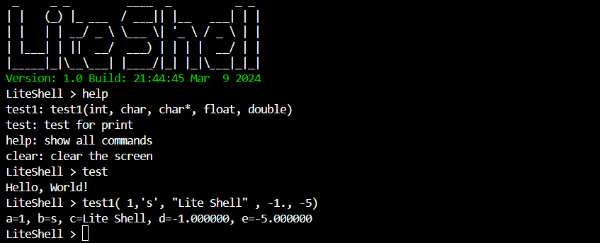

<div align="center">


# *LiteShell*
        

[](https://guidons-master.github.io/LiteShell/)


**轻量高效、简单易用的嵌入式命令行工具**

</div>

## 🚀 项目介绍

**`LiteShell`** 是一个轻量级、高效率且易于使用的嵌入式命令行工具，可以非常方便地集成到任何项目中，仅依赖于 `stdlib` 标准库。它的设计目标是为嵌入式系统提供一个简洁、功能齐全的命令行接口，以便于开发、调试和维护。

## ⚙️ 实现原理

- **命令注册和查找**：通过 `哈希表+链表` 的数据结构实现，可以在 `O(1)` 时间内高效地完成命令查询。
- **命令参数解析**：使用 `有限状态机` 算法实现，可以对命令参数进行高效解析和类型检查。

## 🛠️ 使用说明

使用 `Shell.add()` 函数注册命令，该函数参数如下:
    
```c
void Shell.add(void (*func)(), const char *signature, const char *desc);
```
- `func`：命令函数指针
    - 命令函数的参数类型为 `any_t`，可以接受任意类型的参数
    - 命令函数的参数个数和类型由 `signature` 参数指定
    - 命令函数的返回值类型为 `void`
- `signature`：命令参数签名
    - 用于指定命令函数的参数个数和类型
    - 例如：`"icsfd"` 表示命令函数有5个参数，分别为 `int`、`char`、`char*`、`float`、`double`
- `desc`：命令描述
    - 用于描述命令的功能和用法

LiteShell支持以下基本数据类型作为命令参数:

| 类型                    | 签名 | 示例  |
| ----------------------- | ---- | ----- |
| char(字符)              | c    | 'a'   |
| short、int、long(数字)  | i    | 123   |
| float(单精度浮点数)     | f    | 3.14  |
| double(双精度浮点数)    | d    | 3.141 |
| char*(字符串)           | s    | "abc" |

其中 `any_t` 类型的定义如下:

```
typedef union {
    char c;
    unsigned char uc;
    short s;
    unsigned short us;
    int i;
    unsigned int ui;
    long l;
    float f;
    double d;
    char* str;
} any_t;
```

### 📚 示例代码

```c
#include "liteshell.h"
#include <stdio.h>

// test命令的参数为空
void test() {
    Shell.print("Hello, World!\n");
}

// test1命令的参数为int、char、str、float、double
void test1(any_t a, any_t b, any_t c, any_t d, any_t e) {
    printf("a=%d, b=%c, c=%s, d=%f, e=%lf\n", a.i, b.c, c.str, d.f, e.d);
}

int main() {
    // 初始化Shell
    Shell.init();
    // 注册test命令, 参数为空
    Shell.add(test, "", "test for print");
    // 注册test1命令, 签名为"icsfd"
    Shell.add(test1, "icsfd", "test1(int, char, char*, float, double)");
    // 运行Shell
    while (1) Shell.run();
    // 销毁Shell
    Shell.free();
    return 0;
}
```

### 🏃 运行示例

1.在线体验：[LiteShell for WebAssembly](https://guidons-master.github.io/LiteShell/)

2.在Linux平台下编译和运行示例代码:
```bash
gcc examples/basic.c src/liteshell.c src/port/test.c -Iinclude -o basic
./basic
```

运行效果如下:



## 📦 集成方式

要在您的项目中集成LiteShell，只需要包含 `liteshell.h` 头文件，并链接 `liteshell.c` 源文件即可。您还需要为LiteShell提供 `_putchar` 和 `_getchar` 函数的实现，用于控制台输入输出，参考 [port](./src/port/) 目录下的示例代码。