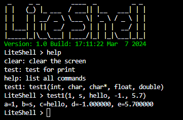

<div align="center">


# *LiteShell*
        


**一个轻量高效、简单易用的嵌入式命令行工具**

</div>

## 🚀 项目介绍

**`LiteShell`** 是一个轻量级、高效率且易于使用的嵌入式命令行工具,可以非常方便地集成到任何项目中,仅依赖于`stdlib`标准库。它的设计目标是为嵌入式系统提供一个简洁、功能齐全的命令行接口,以便于开发、调试和维护。

## ⚙️ 实现原理

- **命令注册和查找**:通过`哈希表+链表`的数据结构实现,可以在`O(1)`时间内高效地完成命令查询。
- **命令参数解析**:使用`有限状态机`算法实现,可以对命令参数进行高效解析和类型转换。

## 🛠️ 使用说明

LiteShell支持以下基本数据类型作为命令参数:

| 类型                    | 签名 | 示例  |
| ----------------------- | ---- | ----- |
| char(字符)              | c    | 'a'   |
| short、int、long(数字)  | i    | 123   |
| float(单精度浮点数)     | f    | 3.14  |
| double(双精度浮点数)    | d    | 3.141 |
| char*(字符串)           | s    | "abc" |

### 📚 示例代码

```c
#include "liteshell.h"
#include <stdio.h>

// test命令的参数为空
void test() {
    Shell.print("Hello, world!\n");
}

// test1命令的参数为int、char、str、float、double
void test1(any_t a, any_t b, any_t c, any_t d, any_t e) {
    printf("a=%d, b=%c, c=%s, d=%f, e=%lf\n", a.i, b.c, c.str, d.f, e.d);
}

int main() {
    // 初始化Shell
    Shell.init();
    // 注册test命令, 参数为空
    Shell.add(test, "", "test for print");
    // 注册test1命令, 签名为"icsfd"
    Shell.add(test1, "icsfd", "test1(int, char, char*, float, double)");
    // 运行Shell
    while (1) Shell.run();
    // 销毁Shell
    Shell.free();
    return 0;
}
```

### 🏃 运行示例

在Linux平台下编译和运行示例代码:

```bash
gcc examples/basic.c src/liteshell.c src/port/test.c -Iinclude -o basic
./basic
```

运行效果如下:



## 📦 集成方式

要在您的项目中集成LiteShell,只需要包含`liteshell.h`头文件,并链接`liteshell.c`源文件即可。您还需要为LiteShell提供`_putchar`和`_getchar`函数的实现,用于控制台输入输出。

```c
// 您的项目源文件
#include "liteshell.h"

// 实现_putchar函数,用于输出字符
void __attribute__((weak)) _putchar(char c) {
    // 将字符c输出到您的控制台或设备
}

// 实现_getchar函数,用于获取字符
int __attribute__((weak)) _getchar() {
    // 从您的控制台或设备获取一个字符并返回
}

int main() {
    Shell.init();
    // 注册您的命令
    ...
    while (1) Shell.run();
    Shell.free();
    return 0;
}
```

就是这样,现在您可以享受LiteShell带来的便利了!如有任何疑问或建议,欢迎随时提出。